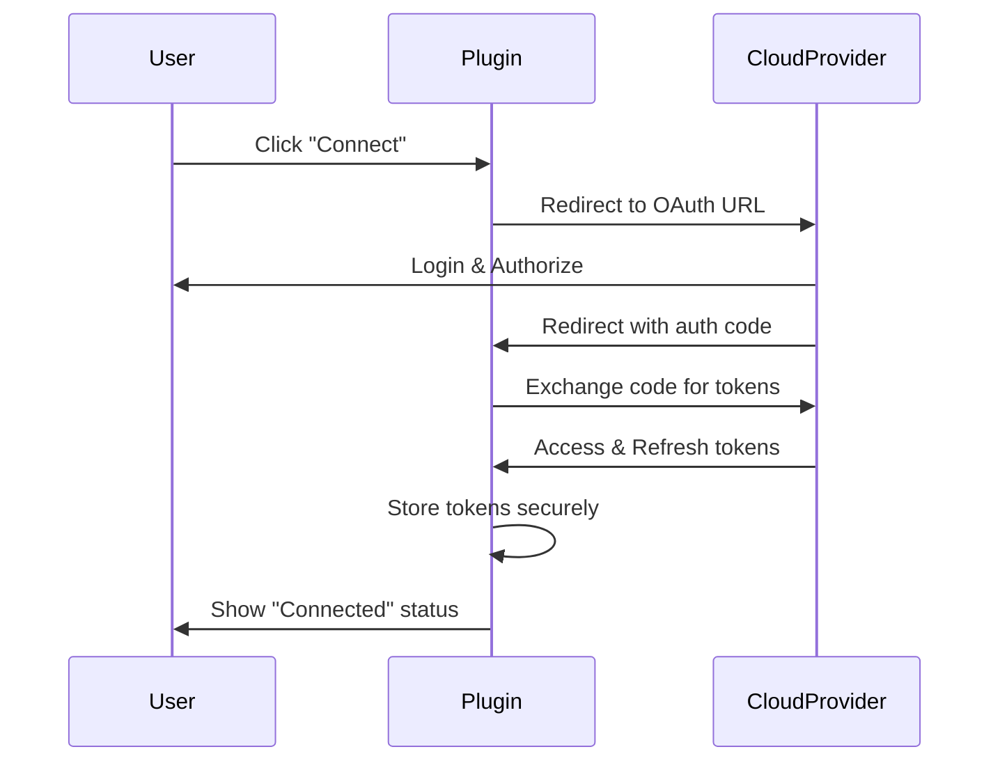

# 06 - Cloud Storage Extensions

> **Priority:** Low | **Complexity:** High  
> **Estimated Time:** 4-5 days

## Summary | Tóm tắt

**EN:** Implement cloud storage extensions for Google Drive and OneDrive in a separate `extensions/` directory with modular architecture.

**VI:** Triển khai các extension lưu trữ đám mây cho Google Drive và OneDrive trong thư mục `extensions/` riêng biệt với kiến trúc modular.

---

## Proposed Changes | Các thay đổi đề xuất

### 6.1 Extension Architecture
**Directory:** `extensions/`

**EN:**
- Extensions are self-contained modules
- Base abstract class defines interface
- Each cloud provider is a separate extension
- Auto-discovery of installed extensions
- Enable/disable per extension
- Independent settings storage

**VI:**
- Extensions là các modules độc lập
- Class abstract cơ sở định nghĩa interface
- Mỗi nhà cung cấp cloud là một extension riêng
- Tự động phát hiện extensions đã cài đặt
- Bật/tắt theo từng extension
- Lưu trữ cài đặt độc lập

---

### 6.2 Cloud Storage Base
**Files:** `extensions/cloud-storage-base/`

```php
<?php
// interface-cloud-provider.php
interface Demo_Builder_Cloud_Provider_Interface {
    public function get_name(): string;
    public function get_slug(): string;
    public function get_icon(): string;
    public function is_connected(): bool;
    public function authenticate(): bool;
    public function disconnect(): bool;
    public function upload(string $file_path, string $remote_name): array;
    public function download(string $remote_name, string $local_path): array;
    public function delete(string $remote_name): bool;
    public function list_files(string $folder = ''): array;
    public function get_quota(): array;
    public function render_settings(): void;
    public function save_settings(array $data): bool;
}

// class-cloud-storage.php - Abstract base class
abstract class Demo_Builder_Cloud_Storage implements Demo_Builder_Cloud_Provider_Interface {
    protected $option_key;
    protected $settings = [];
    
    public function __construct() {
        $this->load_settings();
    }
    
    protected function load_settings() {
        $this->settings = get_option($this->option_key, []);
    }
    
    protected function save_option($data) {
        return update_option($this->option_key, $data);
    }
    
    // Common methods...
}
```

---

### 6.3 Google Drive Extension
**Directory:** `extensions/google-drive/`

**EN:**

**Configuration:**
- OAuth 2.0 authentication flow
- Client ID input
- Client Secret input
- Redirect URI display (for Google Console)
- Connect/Disconnect buttons
- Folder selection dropdown
- Auto-sync toggle

**Features:**
- Manual upload to Google Drive
- Auto-upload after backup creation
- Sync status indicator (synced/pending/failed)
- Download backup from Google Drive
- Delete old cloud backups (retention policy)
- Show storage quota usage

**VI:**

**Cấu hình:**
- Luồng xác thực OAuth 2.0
- Input Client ID
- Input Client Secret
- Hiển thị Redirect URI (cho Google Console)
- Nút Kết nối/Ngắt kết nối
- Dropdown chọn thư mục
- Toggle tự động đồng bộ

**Tính năng:**
- Upload thủ công lên Google Drive
- Tự động upload sau khi tạo backup
- Chỉ báo trạng thái đồng bộ
- Download backup từ Google Drive
- Xóa backups cloud cũ
- Hiển thị sử dụng quota lưu trữ

---

### 6.4 OneDrive Extension
**Directory:** `extensions/onedrive/`

**EN:**

**Configuration:**
- Microsoft OAuth authentication flow
- Application ID input
- Application Secret input
- Redirect URI display (for Azure Portal)
- Connect/Disconnect buttons
- Folder selection dropdown
- Auto-sync toggle

**Features:**
- Manual upload to OneDrive
- Auto-upload after backup creation
- Sync status indicator
- Download backup from OneDrive
- Delete old cloud backups
- Show storage quota usage

**VI:**

**Cấu hình:**
- Luồng xác thực Microsoft OAuth
- Input Application ID
- Input Application Secret
- Hiển thị Redirect URI (cho Azure Portal)
- Nút Kết nối/Ngắt kết nối
- Dropdown chọn thư mục
- Toggle tự động đồng bộ

---

### 6.5 Cloud Queue System
**Table:** `{prefix}demobuilder_cloud_queue`

**EN:**
- Queue uploads for background processing
- Track upload attempts and failures
- Retry failed uploads (max 3 attempts)
- Process queue via WP-Cron

**VI:**
- Queue uploads để xử lý nền
- Theo dõi lần thử upload và thất bại
- Retry uploads thất bại (tối đa 3 lần)
- Xử lý queue qua WP-Cron

---

## Files to Create | Các file cần tạo

```
demo-builder/
└── extensions/
    ├── cloud-storage-base/
    │   ├── cloud-storage-base.php        # Extension loader
    │   ├── interface-cloud-provider.php  # Interface
    │   └── class-cloud-storage.php       # Abstract base
    ├── google-drive/
    │   ├── google-drive.php              # Extension loader
    │   ├── class-google-drive.php        # Provider class
    │   ├── assets/
    │   │   └── admin.js                  # OAuth flow JS
    │   └── views/
    │       └── settings.php              # Settings UI
    └── onedrive/
        ├── onedrive.php                  # Extension loader
        ├── class-onedrive.php            # Provider class
        ├── assets/
        │   └── admin.js                  # OAuth flow JS
        └── views/
            └── settings.php              # Settings UI
```

---

## OAuth Flow | Luồng OAuth



---

## Settings Schema | Cấu trúc Cài đặt

```json
{
  "google_drive": {
    "enabled": false,
    "client_id": "",
    "client_secret": "",
    "access_token": "",
    "refresh_token": "",
    "token_expires": 0,
    "folder_id": "",
    "folder_name": "",
    "auto_sync": false,
    "max_backups": 5
  },
  "onedrive": {
    "enabled": false,
    "app_id": "",
    "app_secret": "",
    "access_token": "",
    "refresh_token": "",
    "token_expires": 0,
    "folder_path": "",
    "auto_sync": false,
    "max_backups": 5
  }
}
```

---

## API Endpoints | Các endpoint API

```php
// AJAX Actions
wp_ajax_demo_builder_cloud_auth_url       // Get OAuth URL
wp_ajax_demo_builder_cloud_callback       // Handle OAuth callback
wp_ajax_demo_builder_cloud_disconnect     // Disconnect provider
wp_ajax_demo_builder_cloud_upload         // Manual upload
wp_ajax_demo_builder_cloud_download       // Download from cloud
wp_ajax_demo_builder_cloud_delete         // Delete from cloud
wp_ajax_demo_builder_cloud_list           // List cloud files
wp_ajax_demo_builder_cloud_quota          // Get storage quota
wp_ajax_demo_builder_cloud_settings       // Save settings
```

---

## Verification | Xác minh

### Manual Tests
1. Google Drive:
   - Enter Client ID/Secret → Connect button works
   - OAuth flow → Redirects and returns with success
   - Upload backup → File appears in Google Drive
   - List files → Shows uploaded backups
   - Delete → Removes file from cloud

2. OneDrive:
   - Enter App ID/Secret → Connect button works
   - OAuth flow → Redirects and returns with success
   - Upload backup → File appears in OneDrive
   - List files → Shows uploaded backups
   - Delete → Removes file from cloud

---

## Dependencies | Phụ thuộc

- 01-core-foundation (extension loader)
- 02-backup-system (backup files)
- cURL PHP extension
- json_decode/json_encode

---

## Security Considerations | Bảo mật

**EN:**
- Store tokens encrypted in database
- Use HTTPS for all API calls
- Validate OAuth state parameter
- Refresh tokens before expiry
- Clear tokens on disconnect

**VI:**
- Lưu tokens được mã hóa trong database
- Sử dụng HTTPS cho tất cả API calls
- Xác thực tham số state OAuth
- Refresh tokens trước khi hết hạn
- Xóa tokens khi ngắt kết nối
